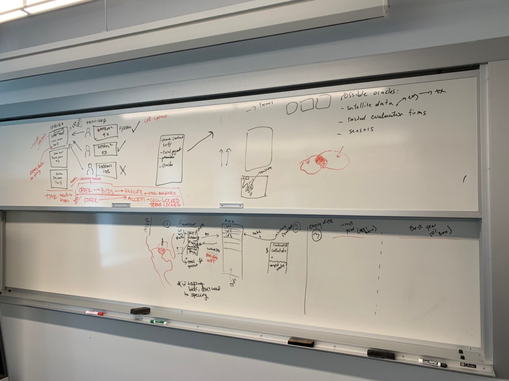
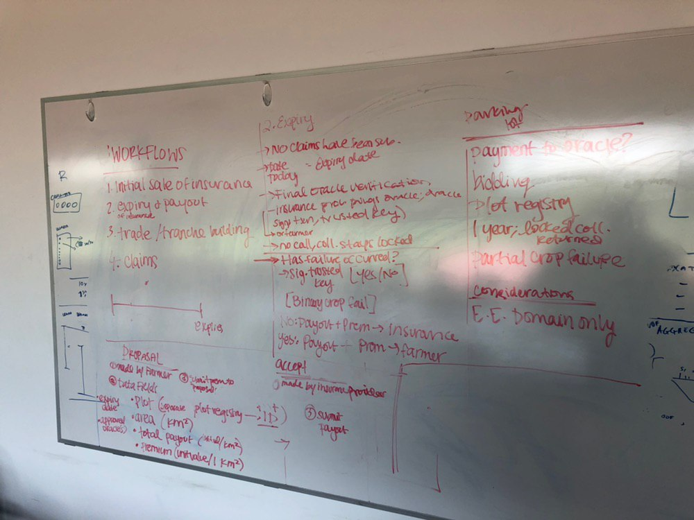

# Indemnity
Blockchain Insurance Project - an [initc3](https://www.initc3.org/events/2019-06-10-IC3-Blockchain-Boot-Camp.html) Ethereum bootcamp project

# Blockchain Insurance Specs

This is an MVP for Crop Insurance ecosystem.

### Key points:
- Anyone can launch/propose
- Collateral would be deposited by the Insurance Buyer (Farmer), Insurance provider will match it. 

## Actors
- Insurance Providers/Issuers (Create their own risk models/assessment)
- Farmers (Insurance buyers, Pools)
- Oracles (To prove/verify the outcome)
- Insurance Traders

## Plot Registry
- Plot ID will be used for insurance ASK
- Mapping (Off-chain or on-chain)
- 
-------------------------------

## Workflow

### 1. Insurance Proposal
Farmer would send send a request `ASK`/`Proposal` providing the following:
  - Plot of land (Location X)
    - for Y Dollars (Per Acre/Unit)
  - Premium (Per Unit) (Unit * Premium) ($$$ ETH) ~~(Collateralize)~~
  - Total Payout (Per Unit)
  - {Approved Oracles}
  - Expiry date

The `ASK` orders will be listed in an `orderbook`. 

### 2. Insurance Provider Accepts Proposal
Insurance providers will come and accept proposals the desire from the `orderbook`: 
  - Match Payout (Total Payout per Unit * Number of Units) ~~Collateral~~ ($$$ ETH)

### 3. Expiry
Assuming no (successful) claim have been submitted in the period of the contract and the expiry date has reached.
  - `Now > Expiry`
  - The request to the Oracles is initiated by either the Farmer or the insurance provider
  - Oracle approves that there has been no losses / (Or Claim process follows)
    - Binary for now: Yes or No (Yes --> Payout, No --> Claim Process)
  - If (No Failure) --> Payment to Insurance provider (Payout + Premium)
  - If (Yes Failure) --> Payment to Farmer (Payout)

### 4. Claim Process

**Notes:**
- `Unit` here is either Acre or KM^2
- In the next versions, this process will be replaced with a bidding process.

## Questions for later
- Payment to Oracles
- Bidding on insurance proposals
- Land Plots (Geography)
- Oracle can send a non-binary response (e.g. 80% of the crops have failed)
- 

## TODO:
- Workflow for executing the contract
  - With percentage Payout
  - Without Payout
- A lot more

## Possible Oracles (Trusted):
- Satellite data
- Trusted evaluation firms
- Sensors

If k out of N oracles approve, then Payout. 

# Security Consideration
- Oracles 
- Double Indemnity
- Payout safety

# Board Sketches

